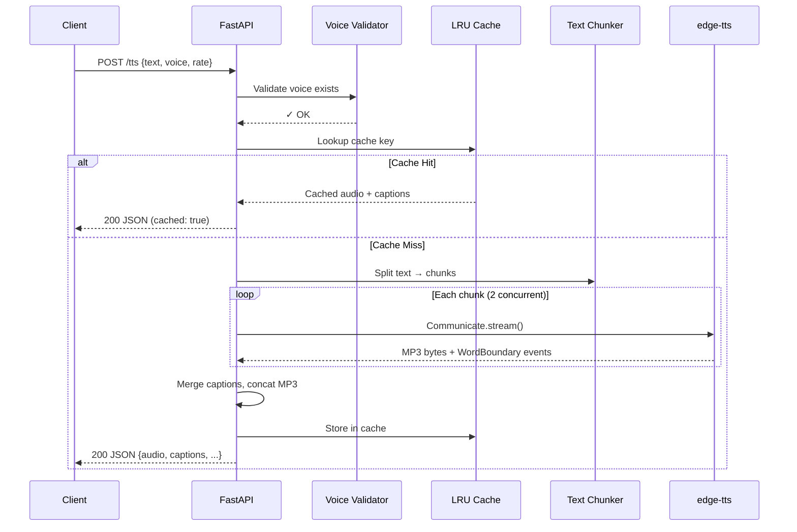
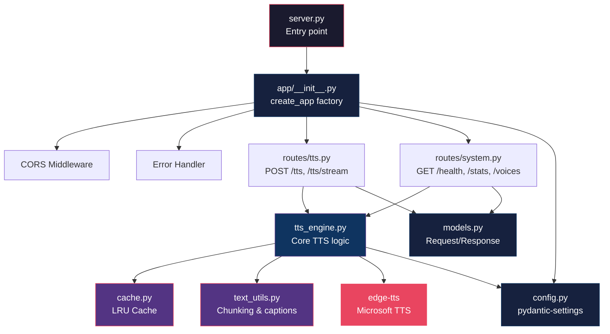
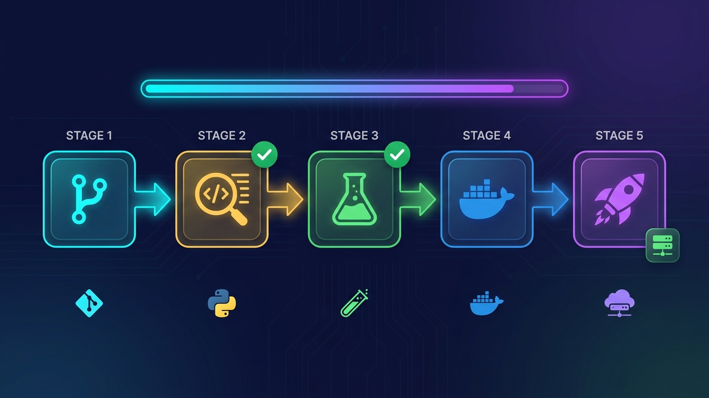
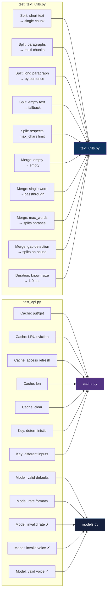

# 🔊 xTTS

> Lightweight, blazing-fast TTS microservice powered by [edge-tts](https://github.com/rany2/edge-tts).  
> Zero GPU required. Docker-ready. Vietnamese-first with 400+ voices.

```
┌──────────────────────────────────────────────────────────┐
│  xTTS — Text-to-Speech Microservice                     │
│                                                          │
│  ✦ Direct edge-tts library calls (no subprocess)         │
│  ✦ Chunk-based processing for unlimited text length      │
│  ✦ Word-level captions merged into natural phrases       │
│  ✦ In-memory LRU cache for instant repeated requests     │
│  ✦ Streaming endpoint for browser <audio> playback       │
│  ✦ CORS-ready, Docker-ready, production-ready            │
└──────────────────────────────────────────────────────────┘
```

---

## 📐 Architecture

```
                          ┌─────────────────────────┐
                          │      Client / Browser    │
                          └────────┬───────┬────────┘
                                   │       │
                          POST /tts│       │POST /tts/stream
                                   ▼       ▼
                          ┌─────────────────────────┐
                          │     FastAPI (async)       │
                          │     ┌───────────────┐     │
                          │     │  CORS / Error  │     │
                          │     │  Middleware     │     │
                          │     └───────┬───────┘     │
                          │             ▼              │
                          │     ┌───────────────┐     │
                          │     │  Input Valid.  │     │
                          │     │  voice + rate  │     │
                          │     └───────┬───────┘     │
                          │             ▼              │
                          │     ┌───────────────┐     │
                          │     │  LRU Cache     │────── hit ──▶ Return cached
                          │     │  (100 entries) │     │
                          │     └───────┬───────┘     │
                          │          miss              │
                          │             ▼              │
                          │     ┌───────────────┐     │
                          │     │  Text Chunker  │     │
                          │     │  ≤500 chars    │     │
                          │     └───────┬───────┘     │
                          │             ▼              │
                          │   ┌─────────────────────┐ │
                          │   │  edge-tts Workers    │ │
                          │   │  (2 concurrent)      │ │
                          │   │                      │ │
                          │   │  chunk₁ ──▶ MP3 + WB │ │
                          │   │  chunk₂ ──▶ MP3 + WB │ │
                          │   │  chunk₃ ──▶ MP3 + WB │ │
                          │   └─────────┬───────────┘ │
                          │             ▼              │
                          │     ┌───────────────┐     │
                          │     │ Caption Merger │     │
                          │     │ words → phrases│     │
                          │     └───────┬───────┘     │
                          │             ▼              │
                          │     ┌───────────────┐     │
                          │     │ MP3 Concat +   │     │
                          │     │ Cache Store    │     │
                          │     └───────┬───────┘     │
                          │             ▼              │
                          │     ┌───────────────┐     │
                          │     │  Response      │     │
                          │     │  base64 / MP3  │     │
                          │     └───────────────┘     │
                          └─────────────────────────┘
```

### Request Flow (Mermaid)



### Module Dependency



### CI/CD Pipeline

<p align="center">
  
</p>

```
Git Push ──▶ Lint (ruff) ──▶ Test (pytest) ──▶ Docker Build ──▶ Deploy
```

| Stage | Tool | Command |
|-------|------|---------|
| Lint | ruff | `make lint` |
| Test | pytest | `make test` |
| Build | Docker | `docker compose build` |
| Deploy | Docker Compose | `docker compose up -d` |

---

## 📁 Project Structure

```
xTTS/
├── app/
│   ├── __init__.py          # App factory (create_app)
│   ├── config.py            # Settings (pydantic-settings, .env)
│   ├── models.py            # Request/Response Pydantic models
│   ├── cache.py             # In-memory LRU cache
│   ├── tts_engine.py        # Core TTS processing & voice validation
│   ├── text_utils.py        # Text chunking & caption merging
│   └── routes/
│       ├── __init__.py      # Router registry
│       ├── tts.py           # POST /tts, POST /tts/stream
│       └── system.py        # GET /health, /stats, /voices
├── tests/
│   ├── test_text_utils.py   # Text chunking & caption tests
│   └── test_api.py          # Cache, model validation tests
├── .env.example             # Environment variable template
├── .dockerignore
├── .gitignore
├── docker-compose.yml
├── Dockerfile
├── Makefile                 # dev, test, lint, docker shortcuts
├── mcp_server.py            # MCP config management server (:3100)
├── pyproject.toml           # Python project config
├── README.md
├── requirements.txt
└── server.py                # Thin entry point
```

---

## 🚀 Quick Start

### Docker (recommended)

```bash
docker compose up -d

# Check it's running
curl http://localhost:3099/health
```

### Native

```bash
cp .env.example .env          # edit as needed
pip install -r requirements.txt
python server.py
```

### Development (auto-reload)

```bash
pip install -e ".[dev]"
make dev
# → http://localhost:3099/docs
```

---

## 📡 API Reference

### `POST /tts` — Generate TTS (JSON response)

Returns base64-encoded MP3 audio with frame-level captions.

**Request:**
```bash
curl -X POST http://localhost:3099/tts \
  -H "Content-Type: application/json" \
  -d '{
    "text": "Xin chào anh em, đây là X Dev. Hôm nay mình sẽ nói về Kubernetes.",
    "voice": "vi-VN-HoaiMyNeural",
    "rate": "+0%"
  }'
```

**Response:**
```json
{
  "audio": "//uQxAAAAAANIAAAAAExBTU...",
  "audioFormat": "mp3",
  "audioSize": 19728,
  "captions": [
    { "startFrame": 3,   "endFrame": 48,  "text": "Xin chào anh em," },
    { "startFrame": 48,  "endFrame": 95,  "text": "đây là X Dev." },
    { "startFrame": 98,  "endFrame": 180, "text": "Hôm nay mình sẽ nói" },
    { "startFrame": 180, "endFrame": 260, "text": "về Kubernetes." }
  ],
  "durationSeconds": 4.8,
  "chunks": 1,
  "elapsed": 1.923,
  "cached": false
}
```

**Fields:**

| Field | Type | Description |
|-------|------|-------------|
| `audio` | string | Base64-encoded MP3 data |
| `audioFormat` | string | Always `"mp3"` |
| `audioSize` | int | Raw audio size in bytes |
| `captions` | array | Phrase-level captions with frame timing |
| `captions[].startFrame` | int | Start frame at 30fps |
| `captions[].endFrame` | int | End frame at 30fps |
| `captions[].text` | string | Caption text (3–6 words) |
| `durationSeconds` | float | Total audio duration |
| `chunks` | int | Number of text chunks processed |
| `elapsed` | float | Server processing time (seconds) |
| `cached` | bool | `true` if served from cache |

---

### `POST /tts/stream` — Generate TTS (binary MP3 stream)

Same request body. Returns raw `audio/mpeg` — ideal for browser `<audio>` or direct download.

```bash
# Save to file
curl -X POST http://localhost:3099/tts/stream \
  -H "Content-Type: application/json" \
  -d '{"text": "Xin chào anh em"}' \
  -o output.mp3

# Play directly (macOS)
curl -X POST http://localhost:3099/tts/stream \
  -H "Content-Type: application/json" \
  -d '{"text": "Xin chào anh em"}' | afplay -
```

**Response Headers:**

| Header | Description |
|--------|-------------|
| `Content-Type` | `audio/mpeg` |
| `Content-Length` | Audio size in bytes |
| `X-Duration-Seconds` | Total duration |
| `X-Captions` | Base64-encoded JSON captions array |
| `X-Chunks` | Number of chunks processed |
| `X-Cached` | `true` / `false` |

---

### `GET /health` — Health Check

```bash
curl http://localhost:3099/health
```

```json
{
  "ok": true,
  "version": "1.1.0",
  "uptime": 3600,
  "edge_tts": "7.0.2",
  "cache_size": 12,
  "voices_loaded": 441
}
```

---

### `GET /stats` — Metrics

```bash
curl http://localhost:3099/stats
```

```json
{
  "requests_total": 150,
  "requests_ok": 148,
  "requests_error": 2,
  "chars_processed": 52340,
  "audio_bytes_generated": 3145728,
  "cache_hits": 45,
  "cache_misses": 105,
  "uptime": 7200,
  "cache_entries": 42,
  "cache_max": 100
}
```

---

### `GET /voices?lang=vi` — List Available Voices

```bash
curl "http://localhost:3099/voices?lang=vi"
curl "http://localhost:3099/voices?lang=en"
curl "http://localhost:3099/voices?lang=ja"
```

```json
{
  "voices": [
    {
      "Name": "Microsoft Server Speech Text to Speech Voice (vi-VN, HoaiMyNeural)",
      "ShortName": "vi-VN-HoaiMyNeural",
      "Gender": "Female",
      "Locale": "vi-VN"
    },
    {
      "Name": "Microsoft Server Speech Text to Speech Voice (vi-VN, NamMinhNeural)",
      "ShortName": "vi-VN-NamMinhNeural",
      "Gender": "Male",
      "Locale": "vi-VN"
    }
  ],
  "total": 2
}
```

### `GET /docs` — Interactive Swagger UI

Open `http://localhost:3099/docs` in browser.

---

## 💻 Usage Examples

### Python

```python
import requests, base64

# JSON response (base64 audio)
resp = requests.post("http://localhost:3099/tts", json={
    "text": "Xin chào, đây là X Dev",
    "voice": "vi-VN-HoaiMyNeural",
    "rate": "+0%",
})
data = resp.json()
with open("output.mp3", "wb") as f:
    f.write(base64.b64decode(data["audio"]))
print(f"Duration: {data['durationSeconds']}s, Captions: {len(data['captions'])}")

# Stream response (raw MP3)
resp = requests.post("http://localhost:3099/tts/stream", json={
    "text": "Xin chào, đây là X Dev",
})
with open("output.mp3", "wb") as f:
    f.write(resp.content)
```

### JavaScript (Browser)

```javascript
// Play audio directly in browser
async function speak(text) {
  const resp = await fetch("http://localhost:3099/tts/stream", {
    method: "POST",
    headers: { "Content-Type": "application/json" },
    body: JSON.stringify({ text, voice: "vi-VN-HoaiMyNeural" }),
  });

  const blob = await resp.blob();
  const url = URL.createObjectURL(blob);
  const audio = new Audio(url);
  audio.play();

  // Parse captions from header
  const captionsB64 = resp.headers.get("X-Captions");
  if (captionsB64) {
    const captions = JSON.parse(atob(captionsB64));
    console.log("Captions:", captions);
  }
}

speak("Xin chào anh em, đây là X Dev");
```

### JavaScript (Node.js)

```javascript
const resp = await fetch("http://localhost:3099/tts", {
  method: "POST",
  headers: { "Content-Type": "application/json" },
  body: JSON.stringify({
    text: "Hello from Node.js",
    voice: "en-US-GuyNeural",
    rate: "+10%",
  }),
});

const { audio, captions, durationSeconds } = await resp.json();
const buffer = Buffer.from(audio, "base64");
require("fs").writeFileSync("output.mp3", buffer);
console.log(`Saved ${durationSeconds}s audio with ${captions.length} captions`);
```

### Remotion (React video)

```tsx
// Use captions for subtitle rendering in Remotion
const { captions } = ttsResponse;

<Sequence from={caption.startFrame} durationInFrames={caption.endFrame - caption.startFrame}>
  <Subtitle text={caption.text} />
</Sequence>
```

---

## 🧪 Testing

### Test Structure

```
tests/
├── test_text_utils.py       # 10 tests — text processing logic
│   ├── TestSplitText        #  5 tests — chunk splitting
│   ├── TestMergeWordCaptions #  4 tests — caption merging
│   └── TestEstimateMp3Dur.  #  1 test  — duration estimation
│
└── test_api.py              # 12 tests — cache & validation
    ├── TestLRUCache          #  5 tests — cache eviction & LRU
    ├── TestCacheKey          #  2 tests — key determinism
    └── TestTTSRequestValid.  #  5 tests — model validation
```

### Test Coverage Map



### Running Tests

```bash
# All tests
make test
# or
python -m pytest tests/ -v

# With coverage
make test-cov

# Specific test file
python -m pytest tests/test_text_utils.py -v

# Specific test class
python -m pytest tests/test_api.py::TestLRUCache -v
```

### Sample Output

```
tests/test_api.py::TestLRUCache::test_put_and_get              PASSED  [  4%]
tests/test_api.py::TestLRUCache::test_evicts_oldest             PASSED  [  9%]
tests/test_api.py::TestLRUCache::test_access_refreshes_order    PASSED  [ 13%]
tests/test_api.py::TestLRUCache::test_len                       PASSED  [ 18%]
tests/test_api.py::TestLRUCache::test_clear                     PASSED  [ 22%]
tests/test_api.py::TestCacheKey::test_deterministic             PASSED  [ 27%]
tests/test_api.py::TestCacheKey::test_different_for_different   PASSED  [ 31%]
tests/test_api.py::TestTTSRequestValidation::test_valid_defaults PASSED [ 36%]
tests/test_api.py::TestTTSRequestValidation::test_valid_rates   PASSED  [ 40%]
tests/test_api.py::TestTTSRequestValidation::test_invalid_rate  PASSED  [ 45%]
tests/test_api.py::TestTTSRequestValidation::test_invalid_voice PASSED  [ 50%]
tests/test_api.py::TestTTSRequestValidation::test_valid_voice   PASSED  [ 54%]
tests/test_text_utils.py::TestSplitText::test_short_text        PASSED  [ 59%]
tests/test_text_utils.py::TestSplitText::test_split_paragraph   PASSED  [ 63%]
tests/test_text_utils.py::TestSplitText::test_split_sentence    PASSED  [ 68%]
tests/test_text_utils.py::TestSplitText::test_empty_text        PASSED  [ 72%]
tests/test_text_utils.py::TestSplitText::test_respects_max      PASSED  [ 77%]
tests/test_text_utils.py::TestMergeWordCaptions::test_empty     PASSED  [ 81%]
tests/test_text_utils.py::TestMergeWordCaptions::test_single    PASSED  [ 86%]
tests/test_text_utils.py::TestMergeWordCaptions::test_max_words PASSED  [ 90%]
tests/test_text_utils.py::TestMergeWordCaptions::test_gap       PASSED  [ 95%]
tests/test_text_utils.py::TestEstimateMp3Duration::test_known   PASSED  [100%]

═══════════════════════ 22 passed in 0.25s ════════════════════════
```

---

## ⚙️ Makefile

```bash
make dev          # uvicorn with --reload
make test         # pytest -v
make test-cov     # pytest with coverage
make lint         # ruff check
make format       # ruff format
make docker-up    # docker compose up -d --build
make docker-down  # docker compose down
make docker-logs  # follow container logs
make clean        # remove __pycache__, .pytest_cache, etc.
```

---

## 🚢 Deploy

### Docker Compose (recommended)

```bash
git clone https://github.com/xdev-asia-labs/xTTS.git
cd xTTS
cp .env.example .env   # adjust settings for production
docker compose up -d

# Verify
curl http://YOUR_SERVER:3099/health
```

### Reverse Proxy (Nginx)

```nginx
location /tts/ {
    proxy_pass http://127.0.0.1:3099/;
    proxy_set_header Host $host;
    proxy_set_header X-Real-IP $remote_addr;
    proxy_read_timeout 60s;
}
```

---

## 🔧 Configuration

All settings can be configured via environment variables or `.env` file.

```bash
cp .env.example .env
```

| Variable | Default | Description |
|----------|---------|-------------|
| **Server** | | |
| `PORT` | `3099` | HTTP server port |
| `LOG_LEVEL` | `info` | Uvicorn log level (`debug`, `info`, `warning`) |
| **TTS Engine** | | |
| `TTS_MAX_CHUNK` | `500` | Max characters per processing chunk |
| `TTS_MAX_RETRIES` | `3` | Retry count per chunk on transient errors |
| `TTS_MAX_TEXT_LENGTH` | `20000` | Maximum input text length |
| `TTS_DEFAULT_VOICE` | `vi-VN-HoaiMyNeural` | Default voice when not specified |
| `TTS_DEFAULT_RATE` | `+0%` | Default speaking rate |
| `TTS_CONCURRENCY` | `2` | Max concurrent edge-tts stream calls |
| **Cache** | | |
| `TTS_CACHE_SIZE` | `100` | Max cached TTS results (LRU eviction) |
| **CORS** | | |
| `TTS_CORS_ORIGINS` | `*` | Allowed origins, comma-separated |
| **Captions** | | |
| `FPS` | `30` | Frame rate for caption timing (match your video) |
| `CAPTION_MAX_WORDS` | `6` | Max words per caption phrase |
| `CAPTION_MAX_GAP_FRAMES` | `10` | Frame gap threshold to split captions |

### Caption Timing Explained

```
Frame 0                Frame 30               Frame 60
│                      │                      │
├──── 1 second ────────┤──── 1 second ────────┤
│                      │                      │
│  startFrame: 3       │  startFrame: 35      │
│  endFrame: 28        │  endFrame: 58        │
│  "Xin chào anh em"  │  "đây là X Dev"     │
```

Captions use frame numbers at the configured FPS (default 30).  
To convert: `time_seconds = frame / FPS`

---

## 🤖 MCP Server (AI Agent Config Manager)

xTTS includes an **MCP Server** (`mcp_server.py`) — a separate FastAPI service that lets AI agents (GitHub Copilot, Claude, etc.) manage xTTS configuration programmatically: view/update `.env`, restart the service, check Docker status.

### Architecture

```
┌─────────────────────┐         ┌─────────────────────────┐
│  VS Code / Copilot  │◀──────▶│  xtts-mcp (:3100)       │
│  (MCP Client)       │  HTTP   │  mcp_server.py          │
└─────────────────────┘         │                          │
                                │  ├─ Read/write .env      │
                                │  ├─ Docker restart       │
                                │  └─ Health check xtts    │
                                └──────────┬──────────────┘
                                           │ docker.sock
                                           ▼
                                ┌─────────────────────────┐
                                │  xtts (:3099)            │
                                │  TTS service             │
                                └─────────────────────────┘
```

### Start with Docker Compose

Both services start together:

```bash
docker compose up -d

# Verify MCP server
curl http://localhost:3100/mcp/config/schema
```

### VS Code Integration

The workspace includes [.vscode/mcp.json](.vscode/mcp.json) to register the MCP server automatically:

```json
{
  "servers": {
    "xtts-config": {
      "type": "http",
      "url": "http://localhost:3100",
      "description": "xTTS deployment configuration manager"
    }
  }
}
```

After `docker compose up -d`, reload VS Code window (`Ctrl+Shift+P` → "Reload Window") for Copilot to pick up the server.

### MCP API Endpoints

#### `GET /mcp/config/schema` — Config Schema

Returns all valid config keys with types, defaults, and descriptions.

```bash
curl http://localhost:3100/mcp/config/schema
```

#### `GET /mcp/config` — Current Config

Returns current `.env` values merged with defaults.

```bash
curl http://localhost:3100/mcp/config
```

```json
{
  "config": {
    "PORT": {
      "value": "3099",
      "default": "3099",
      "is_custom": false,
      "type": "int",
      "description": "Server port"
    }
  }
}
```

#### `GET /mcp/config/{key}` — Get Single Key

```bash
curl http://localhost:3100/mcp/config/TTS_MAX_CHUNK
```

#### `PUT /mcp/config` — Update Single Key

```bash
curl -X PUT http://localhost:3100/mcp/config \
  -H "Content-Type: application/json" \
  -d '{"key": "TTS_MAX_CHUNK", "value": "1000"}'
```

#### `PUT /mcp/config/batch` — Update Multiple Keys

```bash
curl -X PUT http://localhost:3100/mcp/config/batch \
  -H "Content-Type: application/json" \
  -d '{"updates": {"TTS_MAX_CHUNK": "1000", "TTS_CONCURRENCY": "4"}}'
```

#### `POST /mcp/config/reset/{key}` — Reset Key to Default

```bash
curl -X POST http://localhost:3100/mcp/config/reset/TTS_MAX_CHUNK
```

#### `POST /mcp/config/reset` — Reset All to Defaults

```bash
curl -X POST http://localhost:3100/mcp/config/reset
```

#### `GET /mcp/service/status` — Check xTTS Health

Proxies health check to the main TTS service.

```bash
curl http://localhost:3100/mcp/service/status
```

#### `POST /mcp/service/restart` — Restart xTTS Container

Triggers `docker compose restart xtts` via mounted Docker socket.

```bash
curl -X POST http://localhost:3100/mcp/service/restart
```

#### `GET /mcp/docker/status` — Docker Compose Status

```bash
curl http://localhost:3100/mcp/docker/status
```

#### `GET /mcp/env/diff` — Show Custom Overrides

Shows which `.env` values differ from defaults.

```bash
curl http://localhost:3100/mcp/env/diff
```

### Docker Compose Config

```yaml
xtts-mcp:
  build: .
  container_name: xtts-mcp
  restart: unless-stopped
  ports:
    - "3100:3100"
  volumes:
    - ./.env:/app/.env                        # Read/write config
    - ./.env.example:/app/.env.example:ro     # Default reference
    - ./docker-compose.yml:/app/docker-compose.yml:ro
    - /var/run/docker.sock:/var/run/docker.sock  # Docker control
    - /usr/bin/docker:/usr/bin/docker:ro
  command: ["python", "mcp_server.py"]
```

> **Note:** The Docker socket mount allows the MCP server to restart the `xtts` container. Only expose this on trusted networks.

---

## 📜 License

MIT
